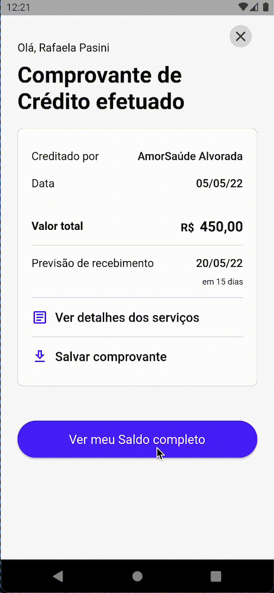

# App Sinaxys Challenge 
 
 O projeto foi realizado a partir do desafio proposto pela a equipe da Sinaxys, o qual consistia em criar as telas apresentadas no [Figma](https://www.figma.com/proto/RbnRqfoSHkZa9P4RZ27KlD/Sinaxys-Pay---Concept?page-id=0%3A1&node-id=316%3A2782&starting-point-node-id=316%3A2782), com navegação entre si.
 
  ## Detalhes do Desenvolvimento:
  * Versão Flutter `3.0.5`
  * Dart `null safety`
  * Navegação `Modular 5.0.3`
  

   ### Resultado Final:
  
 

 
 

 
 ### Download do APK do App
 Para testar o aplicativo basta fazer o || Download do APK|| e instala-lo em seu dipositivo android.

